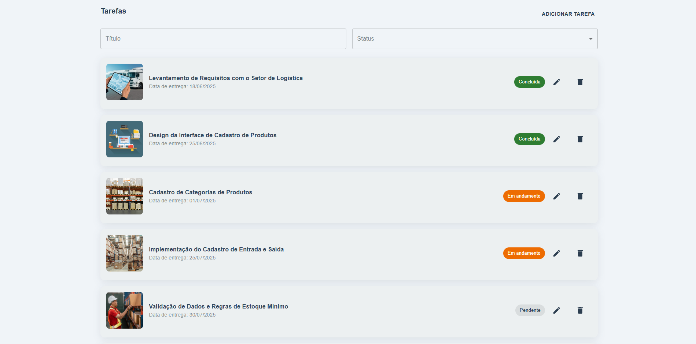
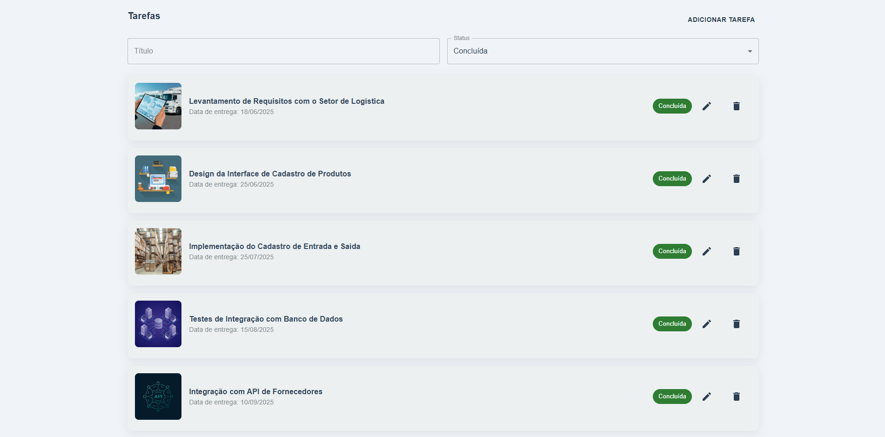
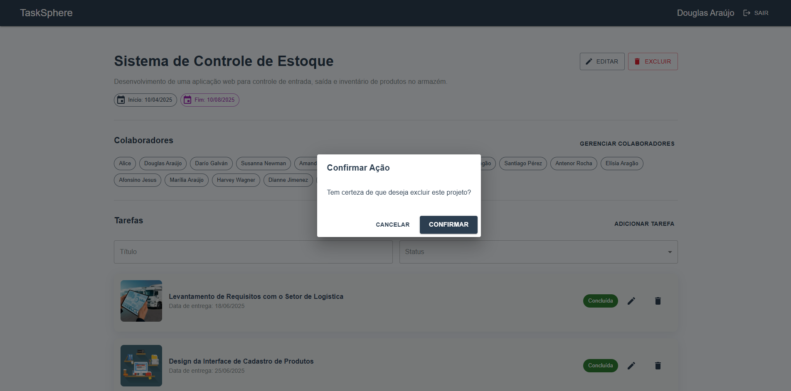

<div align="center">

# 🧠 TaskSphere

Aplicação de **gestão colaborativa de projetos** desenvolvida com React, com foco em autenticação, colaboração entre usuários, gerenciamento de tarefas e consumo de APIs.

</div>

## ✅ Pré-requisitos

- React
- Node.js (v18 ou superior)
- NPM ou Yarn
- PostgreSQL
- Sequelize

---

## ▶️ Como executar o projeto

### 🔧 Backend
1. Clone o repositório e navegue até a pasta do backend:

   ```bash
   git clone https://github.com/thedouglasaraujo/tasksphere
   cd tasksphere
   cd backend
   ```
1. Instale as dependências:

   ```bash
   npm install
   ```
1. Edite o arquivo config/config.js com as credenciais do seu PostgreSQL
2. Rode as migrations:

   ```bash
   npx sequelize-cli db:migrate
   ```
3. Inicie o servidor:

   ```bash
   node src/index.js
   ```
   O servidor estará disponível em: http://localhost:3000

### 💻 Frontend
1. Acesse a pasta do frontend

2. Instale as dependências:
   
   ```bash
   npm install
   ```
4. Execute a aplicação:
    
   ```bash
   npm start
   ```
    A interface será aberta em: http://localhost:3001

### 📄 Configuração do .env

Crie um arquivo .env dentro da pasta backend com as variáveis de ambiente necessárias.

## 🚀 Funcionalidades Principais

- ✅ Autenticação de usuários com email e senha
- ✅ CRUD completo de projetos e tarefas
- ✅ Regras de acesso baseadas em permissões
- ✅ Colaboração entre usuários autenticados
- ✅ Filtros combináveis e busca com paginação
- ✅ Integração com API externa para sugestão de colaboradores

## 🧩 Stack Utilizada

- **React** (com Hooks)
- **React Router DOM**
- **Material UI (MUI)** para layout e responsividade
- **NodeJS** (API local)
- **Random User API** (`https://randomuser.me`) para sugestão e importação de colaboradores

## 🔐 Regras de Acesso

| Ação                        | Criador do Projeto | Colaborador |
|-----------------------------|--------------------|-------------|
| Editar/Excluir Projeto      | ✅                 | ❌          |
| Gerenciar Colaboradores     | ✅                 | ❌          |
| Criar Tarefa                | ✅                 | ✅          |
| Editar/Excluir Tarefa       | ✅ (todas)         | ✅ (as suas) |

## 🎯 Telas Implementadas

- **Login** com validação e proteção de rotas
- **Dashboard** com projetos do usuário
- **Detalhes do Projeto** com tarefas e colaboradores
- **Cadastro/Edição de Projetos**
- **Cadastro/Edição de Tarefas**
- **Gerenciamento de Colaboradores**
- **Tela de Acesso Negado ou Erro Inesperado**

## ✅ Diferenciais Implementados

- **Atomic Design** na organização dos componentes
- **Commits semânticos** seguindo boas práticas
- **Layout responsivo** e visualmente consistente
- **Feedbacks visuais** para carregamento, sucesso e erro

## Imagens da Aplicação

<p align="center">
  
  
  
  
  
  
  
  
  
  
  
  
  
  
  
  
  
  
  
  
  
  
  
  
  
  
  
  
  
  
  
  
  
  
  
  
</p>

